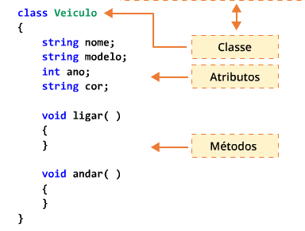
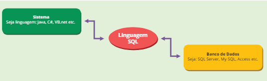
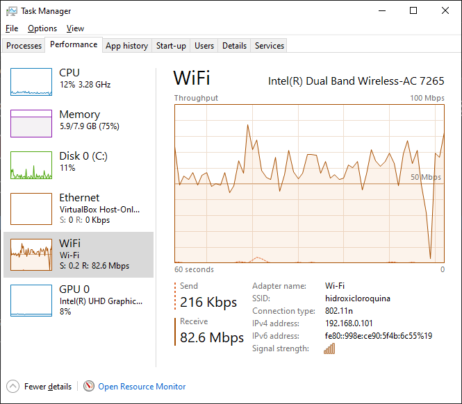
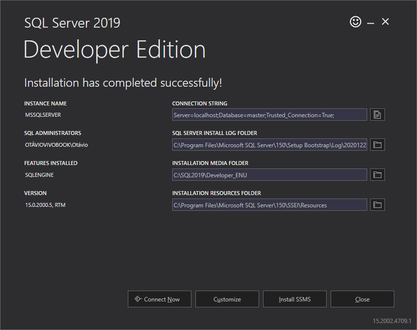

# Capítulo 1 - C#

## Programação Orientada a Objetos

- A orientação a objetos surgiu com o objetivo de tornar o desenvolvimento de softwares **menos complexo e mais produtivo.**
  - Estruturas de dados que possuem estado, comportamento e colaboram entre si
- Substitui o paradigma estruturado.

### Encapsulamento

- Representa a separação do programa em partes
- Torna o software mais flexível
- Facilita a manutenção

### Abstração

- Modela conceitos e elementos do mundo real em um domínio do sistema de software
- Desconsidera as características menos importantes ou acidentais
- Molda uma estrutura comum de um programa que compartilha algumas características

### Polimorfismo

- "Múltiplas formas": possibilita interagir da mesma maneira com objetos diferentes
  - mesmos atributos de objetos podem ser utilizados em outros
- Classe, objeto, atributos,, métodos

#### Classe

- Pacote de códigos, que pode simular objetos do mundo real e apresentar características desses objetos

### Objetos

- Instâncias que possuem características e comportamentos

### Atributo

- Objeto que representa os dados que desejamos associar
- Elementos que definem a estrutura de uma classe
- Ex.: atributos de um veículo - nome, modelo, ano e cor

### Métodos

- Ações que um objeto pode executar 
- Interação com os objetos é feita por métodos.



## Tratamento de Erros (Exceções)

- Precisamos tratar os erros de modo que não apareçam mensagens que o usuário não irá compreender.
- O tratamento de erros também evita a interrupção do processamento ou do andamento da aplicação.

### Try e Catch

- Um bloco **try** é chamado de bloco de proteção. Caso ocorra algum problema com os comandos dentro do bloco, a execução desviará para os blocos **catch** correspondentes.

### Finally

- O uso do bloco **finally** é opcional. No entanto, quando usamos o bloco, ele é executado independentemente da ocorrência ou não de erro, como uma mensagem para fechar o programa.

```c#
try {
	//Instrução que deve ser executada
} catch (nome_exceção) {
    //instrução para tratar a exceção
} finally {
    //instrução opcional executada independentemente da ocorrência ou não do erro
}
```

# Capítulo 2 - Banco de Dados

## Bancos existentes no mercado

- **Oracle:** utilizado em bancos de dados de grande porte. Normalmente, é usado na plataforma UNIX.
- **Access:** usado em aplicações de pequeno porte, em ambiente Microsoft. Não é considerado profissional
- **SQL Server – Microsoft:** utilizado em bancos de dados de grande e médio porte, na plataforma Windows.
- **MySQL:** banco de dados gratuito e dos mais utilizados no mercado, voltado para aplicações de médio e pequeno porte.
- **PostgreSQL:** banco de dados gratuito, voltado para plataforma Linux ou Windows. De modo geral, é utilizado em aplicações de médio e pequeno porte.

Atenção: É fundamental que você conheça a linguagem SQL, independentemente do banco de dados escolhido.

## Linguagem SQL

### Select

- Seleção e visualização dos dados

```
select "coluna" from "tabela";
```

- select/from são de uso obrigatório

```
select * from clientes where estado="SP";
```

### Insert

- Inserir dados (linhas) novos

```sql
insert into "nome tabela" ("coluna 1", "coluna 2", ...)
values ("valor1", "valor2", ...);
```

### Update

- Alteração dos dados que já existem

```
update "nome_tabela"
set "coluna1" = [novo valor]
where "condição";
```

### Importante

- Independentemente da linguagem em que o sistema foi desenvolvido (Java, C#, Visual Basic, etc.) devemos usar a linguagem SQL no trabalho com um banco de dados.
- A linguagem SQL é uma linguagem padronizada para bancos de dados. Desse modo, todos os bancos de dados entendem essa linguagem.
  - Conecta o sistema ao banco de dados



## Conexão com o Banco de Dados SQL

- O banco de dados SQL Server, ao contrário do Access, não gera um arquivo, mas um serviço composto de vários arquivos, sendo muito mais complexo
- Importante: conectar um BD no Visual Studio
  - Server explorer (janela no canto esquerdo): Connect to Database
  - Você não vai conseguir desenvolver aplicações com BD sem fazer isso!

# Capítulo 3 - Construção de Sistemas

### ADO .NET

- Tecnologia de acesso a banco de dados da plataforma .NET que permite a manipulação de dados
- Componentes:
  - Connection - realiza a conexão com o BD
  - Command - executa comando no banco de dados
  - DataAdapter - preenche o DataSet
  - DataSet e DataReader - armazenam informações do banco de dados; conjunto de tabelas.

### Data Set

- É uma cópia do banco de dados.
- Sua principal característica é funcionar em modo desconectado
- Coleciona objetos Data Table
- Intermediação com o banco de dados é feita por meio do Data Adapter

### Data Adapter

- Faz a ligação entre o Data Set e o banco de dados SQL Server, para atualizar o Data Set.
- Métodos:
  - FILL - preenche os DataSet com os dados do BD
  - UPDATE - atualiza o BF com os dados do DataSet

### SqlConnection

- Responsável pela conexão com o banco de dados SQL Server.
  - Mas precisa-se também da ConnectionString
- ConnectionString - contém informações de acesso ao banco de dados

```c#
SqlConnection conexao;
Conexao = new SqlConnection();
Conexao.ConnectionString = "ConnectionString";
```

```c#
SqlConnection conexao = new SqlConnecion (ConnectionString);

conexao.Open();
conexao.Close();
```

### SqlCommand

- Responsável por executar um comando SQL.
- Requer uma Query SQL e um objeto Connection

```
SqlCommand cmd = new SqlCommand("querySQL", conexao);
```

- Métodos:
  - ExecuteReader - Retorna os dados da consulta (SqlDataReader). É usado com o comando SELECT
  - ExecuteNonQuery - Não retorna dados. É usado com os comandos INSERT, UPDATE e DELETE.
  - ExecuteScalar - Retorna um único valor após uma consulta

### Namespaces/Provedores

- SQL Server: `System.Data.SqlClient`
- Oracle: `System.Data.OracleClient`
- etc.

### Etapas para conexão com BD

1. Connection
   - Criar um objeto de conexão (SqlConnection)
2. Command
   - Criar um objeto de execução - comando SQL
3. Open
   - Abrir uma conexão com o banco de dados
4. Executar
   - Executar o comando SQL e processar o resultado - DataAdapter, DataSet, DataReader, DataTable
5. Close
   - Fechar a conexão com o banco de dados.

### Desenvolvimento em camadas

- Evitar redundância, organizar melhor o código, separar as responsabilidades, aumentar a reusabilidade.

  - Metodologia robusta e altamente recomendável

- **Cada camada é um projeto adicionado à solução**

- Camadas:

  - UI (User Interface)
    - Interação com os usuários. 
    - Interface, forms.
    - Faz referência às camadas BLL e DTO
  - BLL (Business Logic Player)
    - Regras de negócio - lógica da aplicação, cálculos, etc.
    - Class Library
    - Faz referência às camadas DAL e DTO

  - DTO
    - Objetos (tabelas)
    - Class Library
    - Essa camada não faz referência a ninguém
  - DAL (Data Access Layer)
    - Responsável pelo acesso a dados
    - Também Class Library
    - Faz referência somente ao DTO

#### Como adicionar referências

- Add > references

### Nyktuoke /dicynebt Ubter

### Multiple Document Interface (MDI)

- Form principal que terá o menu que chamará outros forms.

- Na camada UI > add > MIDI Parent Form

- Definir no Program.cs que a aplicação vai se iniciar por este formulário

```c#
Application.Run(new MDIParent1());
```

  




