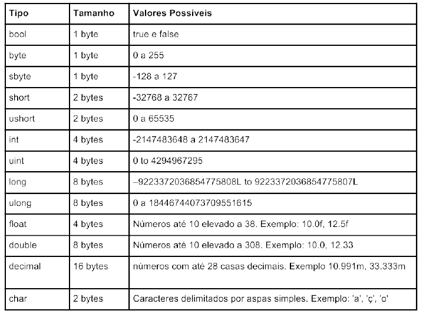
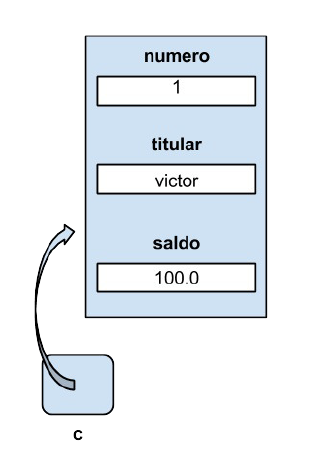
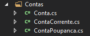
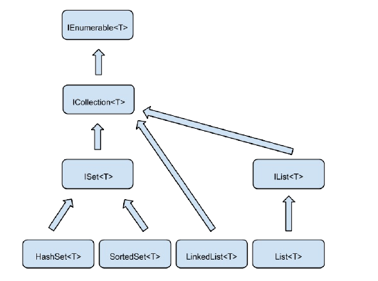
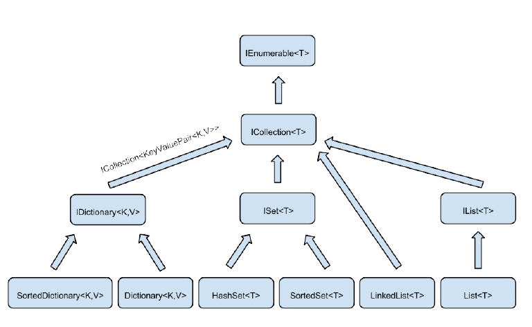

## História e conceitos

- Década de 90: Sun Microsystems processou a Microsoft por violar o licenciamento do Java, impedindo-a de usar o J++, uma variação da linguagem exclusiva para ambiente Microsoft
- Projeto COOL (C-Like Object Oriented Language) - design baseado em outras linguagens como Java, C, C++, Smalltalk, Delphi e VB
  - Lançado em 2002 como linguagem C# e ambiente .NET
- O C# utiliza o conceito de máquina virtual. Entre o sistema operacional e a aplicação existe uma camada extra responsável por "traduzir" o que sua aplicação deseja fazer para as respectivas chamadas do sistema operacional onde ela está rodando no momento
- **A aplicação roda na Common Language Runtime (CLR), ambiente de execução (máquina virtual) para todas as linguagens da plataforma .NET**
  - Isola a aplicação do SO, evitando que ela afete outras máquinas virtuais.
  - Linguagem intermediária: *Common Intermediate Language* (CIL), que é o código compilado

> Linguagem intermediária CIL será executada pela CLR - máquina virtual da plataforma .NET que comporta várias linguagens além do C#

- Common Language Infrastructure
  - CLI = CLR (máquina virtual) + CIL (linguagem intermediária)
- A CLR, por sua vez, precisa emitir o código de máquina correto para o ambiente em que o programa está sendo executado
  - Converte automaticamente o código CLI para código de máquina, por um compilador *Just in Time* (JIT) da CLR
  - Permite que o desempenho seja o mesmo de um compilador sem código intermediário
- O código CIL é colocado pelo compilador em um arquivo executável (arquivo com extensão .exe) dentro da pasta do projeto. Esse arquivo que é resultado da compilação do programa é chamado de Assembly dentro da linguagem C#



---

### Conversão perigosa

```c#
decimal numeroGrande = 10;
double numeroPequeno = 25;

numeroPequeno = (double) numeroGrande;
Console.WriteLine(numeroGrande + "  " + numeroPequeno);
```

```c#
short valorPequeno = 100;
long valorGrande = 25;

valorGrande = valorPequeno; // não precisa do cast pois long > short

Console.WriteLine(valorGrande);
```

```c#
double pi = 3.14;
            int piQuebrado = (int)pi;
            MessageBox.Show("piQuebrado: " + piQuebrado);
```

---

### Classes e Objetos

- Programação procedural (sem uso de objetos): sem garantia de validação de dados e uso de diversas variáveis que ficam espalhadas no código (imagine o registro de contas de clientes de um banco)
- O código da classe, por convenção, deve ficar dentro de um arquivo com o mesmo nome da classe.

```c#
class Conta {
	public int numero;
    public string titular;
    public double saldo;
}
```

- Variáveis que descrevem uma classe: **atributos**
- Classe funciona como uma receita/molde que define o formato das instâncias = objetos
- Ao usar o `new`, o C# cria uma instância, ou seja, aloca memória suficiente para guardar informações do objeto
  - Inclusive retorna uma referência que aponta para o objeto em memória

```c#
Conta c = new Conta();
```

- Definir os atributos armazenados no objeto c

```c#
c.numero = 1;
c.titular = "Victor";
c.saldo = 100;
```



- quando utilizamos um objeto para guardar informações, todos os atributos ficam agrupados dentro de um único objeto na memória, e não espalhados dentro de diversas variáveis diferentes.

#### Métodos para objetos

- Não precisa definir um método estático e passar a referência do objeto por parâmetro

```c#
public void saca(double valor)
{
    if (valor <= saldo)
    {
        saldo -= valor;
    }
}
```

- Basta chamar o método direto do objeto

```c#
c1.saca(15);
```

#### Valores padrão dos atributos

- Quando instanciamos uma classe todos os seus atributos são inicializados para valores padrão. 
  - Ao contrário de variáveis dentro de métodos, que precisam ser inicializadas.
- Valores numéricos são inicializados para zero, o bool é inicializado para false e atributos que guardam referências são inicializados para a referência vazia (valor null do C#).

| Tipo                           | Inicialização  |
| ------------------------------ | -------------- |
| bool                           | false          |
| int, float, double, long, etc. | 0              |
| objetos, vetores               | null           |
| string                         | "" (confirmar) |
| char                           | '' (confirmar) |

```c#
public void transfere (Conta destino, double valor)
        {
            if (this.saca(valor))
            {
                destino.saldo += valor;
            }
        }
```

- Convenção de nomes
  - **PascalCasing**: classes e métodos de classe
  - Argumentos de métodos: **camelCasing**

```c#
Conta mauricio = new Conta(); // mauricio aponta a um objeto
mauricio.Saldo = 2000;

Conta copia = mauricio; // copia passa a apontar para esse objeto (não cria outro)
copia.Saldo = 3000;

MessageBox.Show("Mauricio = " + mauricio.Saldo); // são o mesmo objeto, os dois imprimem 3000
MessageBox.Show("Copia = " + copia.Saldo); // duas variáveis, um objeto
```

- Inclusive, objetos são sempre diferentes entre si, mesmo que tenham os mesmos valores de propriedade. Usou o `new`, o espaço na memória é diferente

---

### Get e Set (encapsulamento)

- **Auto-implemented properties** - a partir do C# 3.0
  - ao utilizarmos as auto-implemented properties, **só podemos acessar o valor do atributo declarado através da propriedade** (mesmo que seja de dentro da classe).

```c#
class Conta
{
	public int Numero { get; set; }
}
```

---

### Construtor

public [nomeClasse] (parâmetros) {

}

---

### Atalhos Visual Studio

`ctrl + .` - atalho para a caixa de erro da linha selecionada

`prop + tab + tab` - cria propriedade facilmente. Tab para navegar entre tipo de dado e nome

`ctor + tab + tab` - cria um construtor para a classe

Instanciar um objeto de classe inexistente dispara um atalho para o VS criar automaticamente. Outros erros também são auxiliados pela IDE.

```c#
textoTitular.Text = c1.Titular.Nome;
textoNumero.Text = Convert.ToString(c1.Numero);
```

`mbox + tab + tab` - cria um MessageBox.Show(" ");

`ctrl + R (2x)` - renomear uma variável ou método

`ctrl + :` - autocomplete

Groupbox: organizar itens do formulário. Não vi a aplicação dele no código

Label: texto na tela

---

- Variáveis dentro de métodos podem ser declaradas como var em C# que o seu tipo é inferido automaticamente. Para o compilador acertar qual o tipo da variável ela deve ser inicializada no mesmo instante que é declarada e não pode ser atribuído o valor null.

```c#
var conta;
conta = new Conta();
conta.Deposita(300);

var tamanho = 5;
tamanho = tamanho / 2.0;
MessageBox.Show(tamanho);
```

---

### Herança

- Maneira de reaproveitar código sem aumentar sua complexidade
- Subclasse = classe filha; classe base = classe pai

```c#
public class ContaPoupanca : Conta { }

ContaPoupanca c = new ContaPoupanca();
c.Deposita(100.0);
```

#### Métodos virtuais e override

- Basta reescrever o comportamento na classe filha, usando a palavra override e mudando a classe pai para indicar que o método pode ser sobrescrito (virtual)

```c#
// Arquivo Conta.cs
public class Conta
{
    public virtual void Saca(double valor)
    {
    	this.Saldo -= valor;
    }
    	// Resto do código da classe
}
// Arquivo ContaPoupanca.cs
public class ContaPoupanca : Conta
{
    public override void Saca(double valor)
    {
    	this.Saldo -= (valor + 0.10);
    }
}
// Código do formulário da aplicação
ContaPoupanca c = new ContaPoupanca();
// chama o comportamento escrito no pai
// O Saldo termina em 100.0 depois dessa linha
c.Deposita(100.0);
// chama o comportamento escrito na ContaPoupanca
// O Saldo termina com o valor 49.90
c.Saca(50);
```

- Atributos privados só são visíveis para a classe que os declarou. Os filhos não enxergam.
- Atributos/métodos marcados como `protected` são visíveis apenas para a própria classe e para as classes filhas:

#### Base

- É possível reutilizar o comportamento do método da classe pai, usando a palavra `base`

```c#
public class ContaPoupanca : Conta
{
	public override void Saca(double valor)
	{
		base.Saca(valor + 0.10);
	}
}
```

---

### Polimorfismo

- Imagine um método que soma os saldos de todas as contas do banco

```c#
public class TotalizadorDeContas 
{
    public double ValorTotal { get; private set; }
    public void Soma (Conta conta) 
    {
        ValorTotal += conta.Saldo;
    }
}
```

- O parâmetro passado deve ser do tipo Conta e, como ContaPoupança é uma Conta (herdeira desta), ela pode ser passada normalmente.
  - Atenção: o código só vai compilar se os métodos e propriedades utilizados no ValorTotal pertencerem à classe pai.
- Polimorfismo: capacidade de uma variável referenciar seu próprio tipo ou filhos desse tipo.
  - Certeza de que a classe TotalizadorDeContas funcionará para todo novo tipo de Conta que aparecer.
- Da mesma forma:

```c#
private Conta conta; // o tipo é Contas
//
this.conta = new ContaPoupanca();
```

#### Herança do construtor

- Por padrão os construtores não são herdados

```c#
public class ContaPoupanca : Conta
{
	public ContaPoupanca(int numero) : base (numero) { }
}
```

---

### Arrays

```c#
Conta[] contas = new Conta[5];
contas[0] = new Conta();

contas[1] = new ContaPoupanca(); // polimorfismo


```

---

### ComboBox

- É uma caixa de seleção
- Inserir elementos nela:

```c#
comboContas.Items.Add(contas[0].Titular.Nome);
comboContas.Items.Add("teste");
foreach (Conta conta in contas)
{
	comboContas.Items.Add(conta.Titular.Nome);
}
// método Add() da propriedade Items
```

- Recuperar o índice do elemento selecionado no ComboBox:

```c#
private void comboContas_SelectedIndexChanged(object sender, EventArgs e)
        {
            int indice = comboContas.SelectedIndex;
        }
```

---

```c#
namespace Banco
{
    public partial class Form1 : Form
    {
        private Conta conta;
        public Form1()
        {
            InitializeComponent();
        }

        private void Form1_Load(object sender, EventArgs e)
        {
            conta = new Conta();
            conta.Numero = 1;

            Cliente cliente = new Cliente("Victor");

            conta.Titular = cliente;
            textoTitular.Text = conta.Titular.Nome;
            textoNumero.Text = Convert.ToString(conta.Numero);
            textoSaldo.Text = Convert.ToString(this.conta.Saldo);

        }
        private void deposita_Click(object sender, EventArgs e)
        {
            string valorDigitado = textoValor.Text;
            double valorOperacao = Convert.ToDouble(valorDigitado);
            conta.Deposita(valorOperacao);
            textoSaldo.Text = Convert.ToString(conta.Saldo);

            MessageBox.Show("Depósito concluído");


        }

        private void textoValor_TextChanged_1(object sender, EventArgs e)
        {

        }

        private void botaoSaque_Click(object sender, EventArgs e)
        {
            double valorSaque = Convert.ToDouble(textoValor.Text);
            conta.Saca(valorSaque);
            textoSaldo.Text = Convert.ToString(this.conta.Saldo);

            MessageBox.Show("Sucesso no saque");
        }
```

- Obs.: ainda não sei muito bem (preciso de mais exercícios!) como relacionar dois formulários pelo construtor (ou pelo outro jeito que foi feito)

- Obs.2: criar um botão que abre um formulário

  - ```c#
     private void botaoNovaConta_Click(object sender, EventArgs e)
            {
                // instanciar um (objeto) novo formulário
                FormCadastroConta formCadastro = new FormCadastroConta(this);
      
                // abrir a nova janela
                formCadastro.ShowDialog();
            }
    ```

    

---

### Classes abstratas

- Classe abstrata: classe de referência/base para outras classes que vão herdar dela.
  - Não dá para instanciar objetos!
- Conta pode ser classe abstrata para ContaPoupanca e ContaCorrente. Não faz sentido instanciar objetos dela

```c#
public abstract class Conta
{
	public virtual void Saca(double valor) { } // deixa este método em branco
}
```

- **Método abstract**
  - Obriga as classes herdeiras a implementar o método

```c#
public abstract void Saca(double valor); // o método está incompleto
```

- Uma classe abstrata pode não ter um método abstrato, mas **todo método abstrato precisa estar em uma classe abstrata**

> Repare que herdamos os métodos Saca e Deposita da classe Conta , porém cada tipo de Conta sobrescreve esses métodos, logo eles são bons candidatos para métodos abstratos.

---

### Interfaces

- Interfaces são bem mais simples do que classes. Elas não tem atributos e seus métodos não tem implementação. A interface apenas nos garante que o método existirá naquela classe. Por esse motivo, apesar de C# não suportar herança múltipla (ser filho de mais de uma classe), podemos implementar quantas interfaces quisermos. Basta colocar uma na frente da outra.
  - Quando uma classe utiliza tanto herança quanto interfaces, precisamos sempre declarar qual é a
    classe pai e depois as interfaces

```c#
public interface ITributavel
{
	double CalculaTributo();
}
```

```c#
public class ContaInvestimento : Conta, ITributavel, OutraInterfaceQualquer
{
	// implementa os métodos das interfaces Tributavel e OutraInterfaceQualquer
}
```

- A convenção de nomes do C# para uma interface: usar um I no começo do nome
- com interfaces conseguimos fazer com que um conjunto de classes implemente
  os mesmos métodos.
- Repare que, para implementarmos o método da interface, não podemos utilizar a palavra
  override , ela é reservada para a sobrescrita de métodos da Herança.
- Métodos declarados em uma interface nunca possuem implementação e sempre são públicos.
  - Não dá para colocar visibilidade como public, pois já é por padrão
- A convenção de nomes do C# para uma interface é seguir a mesma convenção de nomenclatura de classes porém com um I no começo do nome
- Código maluco:

```
ContaCorrente c = new ContaCorrente();
c.Deposita(500);

MessageBox.Show("Imposto da conta corrente: " + c.CalculaTributos());

// cria uma variável ITributável t que aponta a um objeto
// isso significa que Conta e ContaCorrente (classes) não são os únicos tipos para manipular o objeto, podendo ser feito pelas interfaces??

ITributavel t = c; // como essa igualdade é possível??
// MessageBox.Show("Saldo: " + t.Saldo); // não rola
// então a manipulação pela interface só dá através dos métodos dela?
MessageBox.Show("Imposto cc pela interface:" + t.CalculaTributos());

TotalizadorDeTributos j = new TotalizadorDeTributos();
j.Adiciona(t);
MessageBox.Show("Soma dos impostos: " + j.Total);
```

#### is

- Checar se dois objetos/variáveis são do mesmo tipo
- Não pesquisei muito a respeito, cuidado ao usar

```c#
object obj = 123;
if (obj is string)
{
	Console.WriteLine("São do mesmo tipo!");
}
```

#### as

- Converter um tipo para outro
  - Se não for possível, a variável fica com `null`

```c#
string x = obj as string;
```

> procure saber mais!

---

### Métodos e atributos estáticos

- Imagine um atributo/método que pertença à classe e seja compartilhado por todos os objetos.
  - Não precisa criar uma instância para utilizá-lo
- 

### Classe estática

- Não pode ser instanciada e nem herdada
  - Logo, só possui membros estáticos

```c#
public static class Funcoes
{
	public static bool MetodoEstatico()
	{ 
		// ...
	}
}
```

---

### Exceções

```c#
public override void Saca (double valor)
{
    if (valor < 0)
    {
        // throw new Exception();
        throw new ArgumentException(); // classe padrão do C#
    }
    if (valor + 0.10 > this.Saldo)
    {
        // throw new Exception("Valor de saque maior que o saldo");
        throw new SaldoInsuficienteException();
    }
    else
    {
        this.Saldo -= valor + 0.10;
    }
}
```

- Quando não há tratamento (sem o try), aparece uma mbox com a mensagem de erro.

```c#
private void botaoSaque_Click(object sender, EventArgs e) 
{
	int indice = comboContas.SelectedIndex;
	double valor = Convert.ToDouble(textoValor.Text);
	Conta selecionada = this.contas[indice];
	try
	{
		selecionada.Saca(valor); // aqui há a possibilidade de lançar uma exceção
		textoSaldo.Text = Convert.ToString(selecionada.Saldo);
		MessageBox.Show("Dinheiro liberado");
	}
    catch (SaldoInsuficienteException ex)
    {
        MessageBox.Show("Saldo insuficiente");
    }
    catch (ArgumentException ex)
    {
        MessageBox.Show("Não é possível sacar um valor negativo");
    }
}
```

- Para mais de uma exceção, deve-se criar uma nova classe que herde de Exception

```c#
public class SaldoInsuficienteException : Exception { }
```

- Vantagem de usar exceções: tratamento de erros fica isolado da lógica de negócios, não mistura o código com if-else.

---

### Namespaces

```c#
Caelum.Banco.Usuarios.Gerente guilherme = new Caelum.Banco.Usuarios.Gerente();
```

```c#
using System;
using Caelum.Banco.Usuarios;
```

- `using` para facilitar o uso de classes de outro namespace
- Obs.: namespaces aninhados: o nome "gruda", o código interno aos dois é referenciado por PrimeiroNamespace.SegundoNamespace;

#### Alias para namespaces

- Quando se tem duas classes com o mesmo nome em 2 namespaces diferentes, não é possível importar com o using, pois o compilador não saberá qual estamos referindo.

- Assim, só resta usar o nome completo do namespace.

  - Mas, se ele for muito grande, pode ser cômodo dar-lhe um apelido, basta criar uma 'variável' no using que vai receber o namespace

  - ```c#
    using Caelum.Banco.Produtos.Contas;
    using SegurancaDoBanco = Caelum.Banco.Seguranca;
    
    // ...
    
    public void Autentica(SegurancaDoBanco.Conta contaUsuario)
    {
        // implementação
    }
    ```

- Também é possível definir um alias para uma classe do namespace



---

### Classe Object

- Implicitamente, toda classe herda dela (e, também, suas herdeiras).
- É uma classe abstrata?

```c#
public abstract class Conta : Object
{
	// ...
}
```

#### Método Equals

- Faz uma comparação entre dois objetos

```
if (c1.Equals(c2))
{
	MessageBox.Show("Iguais");
}
```

- Se não for sobrescrita, fará uma mera comparação por referências e, como as variáveis apontam objetos diferentes, o resultado nunca será igual.

```c#
public override bool Equals (Object outro)
{
	// implementaçaõ da igualdade de contas: por exemplo, serão iguais se os números também forem
    Conta outraConta = (Conta) outro; // precisa converter pois outro não tem a propriedade Numero
	return this.Numero == outro.Numero;
	
}
```

- Repare que o método Equals recebe o tipo Object . Sendo assim, podemos comparar a conta com qualquer outro objeto do sistema, por exemplo, a string
- Às vezes o cast pode ser inválido (ex.: converter string para conta), e isso pode gerar uma exceção
  - Para evitar o erro, é bom fazer um teste lógico antes

```c#
public override bool Equals (Object outro)
{
    if (outro is Conta) 
    {
        Conta outraConta = (Conta) outro;
        return this.Numero == outraConta.Numero;
    }

    return false;
}
```

- Podemos fazer `override` de `ToString()`

```c#
public abstract class Conta
{
	public Cliente Titular { get; set; }
	public override string ToString()
	{
		return this.Titular.Nome;
	}
}

// no forms1: --------

// comboContas.Items.Add(conta.Titular.Nome);
comboContas.Items.Add(conta);
```

> voltar no exercício 4 da página 147 (e fazer o 5 também!)

---

### Listas

- List: classe do C#, coleção mais versátil que arrays, com métodos próprios.3
- Para criar uma lista precisa-se informar qual o tipo de elemento que ela armazenará

```c#
List<Conta> lista = new List<Conta>();

lista.Add(c1); // posição 0
lista.Add(c3); // posição 1

Conta conta = lista[0];

foreach (Conta c in lista) 
{
    
}
```

| Método                      | O que faz                         |
| --------------------------- | --------------------------------- |
| `lista.Add(elemento);`      | Adiciona um item no final         |
| `lista.Remove(elemento);`   | Remove pelo elemento              |
| `lista.RemoveAt(posicao);`  | Remove pelo índice                |
| `lista.Count;`              | Retorna a quantidade de elementos |
| `lista.Contains(elemento);` | Retorna true ou false             |
|                             |                                   |

- Então não existe o `.Add()` para arrays?? Nem tinha percebido

---

### Conjuntos

#### 1. Classe HashSet

- Categoriza cada um dos elementos para otimizar a busca.
  - Não possui índices, **não há ordem** em um conjunto
  - A categoria é dada pelo método `GetHashCode()`da classe Object do C#.
    - Devolve um número inteiro que representa a categoria do objeto.
- Boa prática: sobrescrever o `GetHashCode()` junto com o `Equals()`, seguindo a seguinte regra: se dois objetos são iguais, eles devem estar na mesma categoria.
  - se `objeto1.Equals(objeto2) == true`

```c#
HashSet<string> devedores = new HashSet<string>();

devedores.Add("victor");
devedores.Add("osni");
devedores.Add("osni");

Console.WriteLine(devedores.Count); // 2
bool contem = devedores.Contains("osni"); // true
```

| Métodos/propriedades           | Descrição                                                    |
| ------------------------------ | ------------------------------------------------------------ |
| `conjunto.Add(elemento);`      | Adiciona ~~na última posição~~                               |
| `conjunto.Count;`              | Retorna a quantidade de elementos                            |
| `conjunto.Contains(elemento);` | Retorna se um elemento pertence ou não ao conjunto (true/false) |
| `conjunto.Remove(elemento);`   | [checar]                                                     |

- O conjunto não guarda elementos repetidos, então adicionar novamente outro objeto igual não vai aumentar o número de membros.

#### 2. SortedSet

- Mesmos métodos e propriedades do HashSet
- A diferença é que aqui os itens não estão espalhados, e sim armazenados em ordem crescente (ou alfabética)

```c#
SortedSet<string> devedores = new SortedSet<string>();

devedores.Add("Ettore");

foreach(string nome in devedores)
{
    MessageBox.Show(nome); // imprime na ordem alfabética
}
```

- Dá para usar foreach no HashSet?
- **Obs.: Interface ISet**
  - Declara todos os comportamentos comuns aos conjuntos SortedSet e HashSet

Listas vs Conjuntos

| Lista                                      | Conjunto                                         |
| ------------------------------------------ | ------------------------------------------------ |
| Elementos armazenados na ordem de inserção | Na ordem que desejar, para deixar a busca rápida |
| Aceita repetição                           | Não há repetição                                 |
| Pode-se acessar elementos por índice       | Não existe índice                                |

- Obs.: ICollection
  - Tanto listas quanto conjuntos implementam uma interface chamada `ICollection`
- IEnumerable
  - onde existe o foreach



- `conjunto.Clear();`

---

### Dicionários

#### Dictionary

```c#
Dictionary<String, Conta> dicionario = new Dictionary<String, Conta>();

conta busca = dicionario["Victor"];

dicionario.Add(conta.Titular.Nome, conta);
```

- Associar uma chave a um valor
- Buscas mais rápidas sem precisar de um loop foreach

#### Iterando no dicionário

- Tipo `KeyValuePair` consegue guardar um par de chave associado a um valor do dicionário

```c#
foreach (KeyValuePair<string, Conta> par in dicionario) 
{
	string chave = par.Key;
    Conta valor = par.Value;
}
```

- Os elementos não estão em nenhuma ordem particular, assim como no HashSet

#### Sorted Dictionary

- Elementos estão sempre na ordem crescente das chaves do dicionário

```
SortedDictionary<string, Conta> dic = new SortedDicionary<string, Conta>();
```



---

### Linq e Lambda

- **Linq**: filtrar coleções (listas, conjuntos, dicionários) e arrays.
  - Pode ser utilizado com qualquer objeto que possa ser passado para a instrução `foreach` (interface `IEnumerable`)
  - Método `Where()`
- **Lambda = função anônima**: passar um bloco de código que pode ser utilizado por um método
  - Funciona como método estático

```c#
(Conta c) => { return c.Saldo > 2000; }
```

```c#
contas.Filtra((Conta c) => {return c.Saldo > 2000;});

//
List<Conta> contas = // inicializa a lista
    
var filtradas = contas.Where((Conta c) => { return c.Saldo > 2000; });
// lista de contas filtradas
```

- Não precisa indicar o tipo da variável pois já está definido na lista
- E, se tiver apenas uma linha que devolve um valor, pode remover as chaves e o return

```c#
var filtradas = contas.Where(c => c.Saldo > 2000;)
```

#### Outros métodos do Linq

- **Sum**

```c#
double saldoTtotal = contas.Sum(c => c.Saldo);

// soma do saldo de todos os elementos da lista
```

- **Average**

```c#
double mediaDosSaldos = contas.Average(c => c.Saldo);
```

- **Count**

```c#
int numero = contas.Count(c => c.Numero < 1000);

// quantas contas têm número menor que 1000
```

- **Min**

```c#
int menorNumero = contas.Min(c => c.Numero);
```

- **Max**

```c#
double maiorSaldo = contas.Max(c => c.Saldo);
```

- **Where**

```
List <Conta> lista = contas.Where(c => c.Saldo > 100);

// checar se isso está certo
```

- Obs.: o lambda é um argumento opcional para estes métodos em uma lista com **tipos primitivos**

  - ```c#
    double maiorNumero = lista.Max()
    
    double media = saldos.Average();
    ```


#### Sintaxe de queries

- É possível fazer buscas utilizando algo próximo à linguagem SQL
- A primeira palavra a ser utilizada é o `from`, depois `select` e `where`
- O código fica mais amigável para o programador e a conversão para o método where fica a cargo do compilador

```c#
var filtradas = from c in contas
				where c.Numero > 1000
				select c;
```

#### Projeções e objetos anônimos

- Quando se quer devolver (select) mais de um atributo, pode-se criar uma classe que contém os atributos
  - O problema é que muitas vezes só se faz a busca em um ponto da aplicação, não valendo a pena confeccionar uma classe
- Ou então pode-se criar um objeto anônimo, que não tem classe ou ela não foi definida
  - `select new { obj.Propriedade1, obj.Propriedade2 }`

```c#
var resultado = from c in contas
				where <condição da busca>
				select new { c.Numero, c.Titular };
```

- Quando utilizamos o objeto anônimo no LINQ, somos forçados a utilizar a inferência de tipos (tipo var).
- Devolve o objeto com as propriedades do select

```c#
foreach (var c in filtradas)
{
	MessageBox.Show(c.Titular.Nome + " " + c.Numero);
    // não dá para usar c.Saldo, por exemplo
}
```

#### Ordenando coleções com Linq

`orderby`

```c#
List<Conta> contas = // inicializa a lista de contas

var resultado = from c in contas
				where c.Saldo > 10000
				orderby c.Titular.Nome descending, c.Numero
				select c;
```

- Ordenado pelo nome de Z a A, segundo critério é o número (ambos são separados por vírgula)

- É o mesmo que:

```c#
var resultado = contas
    			.Where(c => c.Saldo > 10000)
    			.OrderByDescending(c => c.Titular.Nome)
    			.ThenBy(c => c.Numero);
```

---

### System.IO

#### Leitura de arquivos

Já volto!!

---

### Manipulação de Strings

- uso de métodos da classe String

```c#
string txt = string.Format("Olá {0}, a sua idade é {1}", nome, idade);

// concatenação não é somente para Console.Write();
```

- Dividir string em um array de strings, dado determinado caractere como divisor: 

```c#
string texto = "guilherme silveira,42,são paulo,brasil";
string[] colunas = texto.Split(',');
```

- Sempre que chamamos um método em um objeto String, **um novo objeto é criado e retornado pelo método**, mas o original nunca é modificado. Strings são imutáveis.

```c#
string curso = "abc";
curso.ToUpper();
Console.WriteLine(curso); // imprime abc, e não ABC
```

- Substituir parte do conteúdo: `Replace`

```c#
string curso = "abc";
curso = curso.ToUpper().Replace("ab", "df");
MessageBox.Show(curso); // dfC

// confirmar
```

- Substring

```c#
string nomeCompleto = "otávio augusto";
string nome = nomeCompleto.Substring(0, 6);
MessageBox.Show(nome); // otávio

str.Substring(n); // vai desse índice até o final [checar]
```

- IndexOf

```c#
int posicaoCaractere = nomeCompleto.IndexOf("o"); // pq não é ''?
```

---

Acabou. Mas não fiz os exercícios do último capítulo nem do apêndice. Também sequer estudei o penúltimo. Mas finalizei a apostila.

