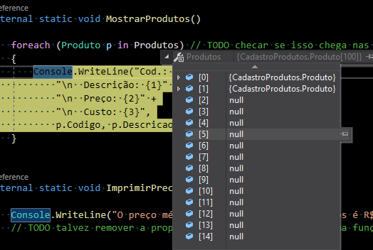

## Instruções

Caro(a) aluno(a), 

Segue a sua atividade avaliativa para este nivelamento: 

Faça um programa em C# do tipo “Console App” que apresente um menu contendo as seguintes opções: 

a)	Cadastrar produto 

b)	Atualizar o preço de um produto 

c)	Imprimir o preço médio dos produtos 

d)	Imprimir listagem de produtos 

Ao escolher a opção (a) o programa deve solicitar **o código (inteiro), a descrição (texto), o preço (número real) e o custo (número real) de um produto** e adicioná-lo em um vetor de produtos. A cada vez que o usuário escolher a opção (a) no menu, o programa deve permitir cadastrar um e apenas um novo produto. O tamanho máximo do vetor de produtos deve ser 100. Se o vetor estiver cheio o sistema deve informar isso ao usuário e não deve permitir cadastrar novos produtos. 

> criar vetor de objetos Produto de tamanho 100

Ao escolher a opção (b) o sistema deve solicitar ao usuário que informe o código do produto que terá o seu preço atualizado. Se existir um produto com o código informado, o sistema deve perguntar se será concedido um desconto ou um acréscimo no preço. Se escolhido acréscimo, o sistema deve perguntar o **percentual** de acréscimo e atualizar o preço do produto. Se escolhido desconto, o sistema deve solicitar ao usuário o percentual de desconto e atualizar o preço do produto. Caso o código do produto informado pelo usuário não exista no vetor, o sistema deve informar a mensagem “Código do produto inexistente”. 

Escolhendo a opção (c) o sistema deve calcular e imprimir a média de preço dos produtos. 

Ao escolher a opção (d) o sistema deve imprimir todos os produtos cadastrados. Para cada produto deve ser impresso o código, a descrição, o preço, o custo e o lucro (preço - custo). 

Observação 1: Você deve definir o que é um produto nesse programa através da classe Produto que deverá ser criada por você. 

Observação 2: você pode usar o seu conhecimento da linguagem C# (até mesmo o relacionado a conteúdo ainda não abordado no curso). Apenas saiba que essa aplicação deve ser do tipo Console e não deve ter persistência, pois os dados devem ficar armazenados temporariamente em um vetor na memória. 

Observação 3: a entrega desse trabalho pode ser feita compartilhando em seu Google Drive um arquivo zip (compactado) contendo todo o código fonte do mesmo (compacte a pasta onde você salvou a solução, suba o arquivo para o seu Google Drive e compartilhe-o). Outra opção para entrega é através de um link para o seu projeto em seu GitHub. Escolha uma dentre estas duas opções, mas certifique-se de que eu receberei todo o código fonte necessário para a correção. 

Bom trabalho! 

Camillo

---

- Pelo visto não dá para usar o foreach quando o vetor tiver elementos nulos (pois dá um erro ao tentar capturar uma propriedade)

