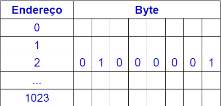
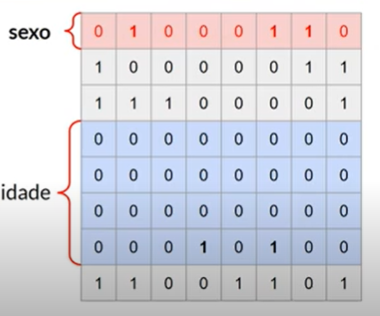

## Organização básica de um computador

### Processador

- Executa sequências de operações muito simples e precisas, sempre uma por vez

### Memória Principal (RAM - Random Access Memory)

- **É na memória principal que o processador armazena os resultados de cada uma das operações que ele realiza.**
  - Meio temporário de armazenamento de dados

### Memória Secundária

- Memória não volátil, permanente (teoricamente) e mais lenta
- **Um programa carregado em memória secundária precisa ser carregado na memória principal antes de ser executado.**

### Bits e Bytes

#### Bit (Binary DigiT)

- Menor unidade de informação, que armazena somente 0 ou 1

#### Byte (BinarY Term)

- Conjunto de 8 bits, com o qual pode-se representar números, letras, sinais de pontuação, etc.

#### Word

- É a quantidade de bits que a CPU processa por vez
- Nos computadores atuais, são comuns palavras de 32 bits ou 64 bits

---

- Representação de uma memória de 1KB



- Arquivo executável: linguagem de máquina, sequências de 0's e 1's

### Sintaxe

- Conjunto de regras que definem como uma linguagem de programação pode ser utilizada
- **Seguir essas regras é essencial para que o compilador possa as traduzir para o código de máquina**

### Semântica

- Combinação de instruções com significado lógico
  - Seguem uma finalidade
- Encontrar erros de semântica é tarefa do programador


---

Quem controla a execução do compilador (e de qualquer outro programa) é o Sistema Operacional

Uma solução pode conter um ou mais projetos

A quantidade de espaço reservado para uma variável é determinada pelo tipo de dado da variável



```c#
Console.Write("Olá "); // imprime uma contante

Console.WriteLine(nome); // imprime uma variável

Console.Write("Olá {0}{1}{0}", nome, "!"); // saída de dados com marcadores
```

`ReadLine()` retorna o que o usuário digitou

```
int a = 10;
int b = -a; // operador unário (só um operador)

```

***Se um dos operandos for double, já é considerada divisão real***

O operador % só está definido para números inteiros

```
{0:N3}
```

- passagem de parâmetro por valor: cópia
- passagem de parâmetro por referência
- um vetor é inicialmente preenchido por valores-padrão
- Criar uma outra variável apontando para o mesmo vetor (não usar o new)
  - Cuidado: a passagem de um vetor por parâmetros o modifica, mesmo que o procedimento/função seja void
  - É possível preencher um vetor por um procedimento

---

## Classes

- Uma classe define um tipo de objeto
- Uma classe é uma estrutura heterogênea, que contém
  - Uma coleção de uma ou mais variáveis relacionadas (atributos)
  - Uma coleção de procedimentos ou funções (métodos)

switch case: o valor da expressão deve ser igual ao da constante do caso. Pode ser qualquer expressão

